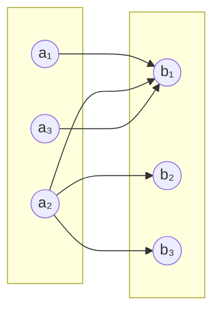
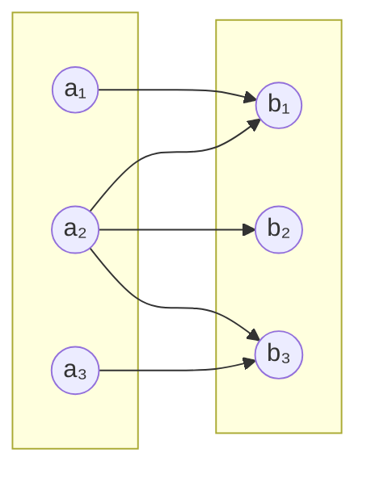

## Intro: Traditional Decentralized Trade

### Market Clearing Mechanism: Walrasian Auctioneer

- Prices are set by a **central auctioneer** to clear the market.
    
- Agents act as **price takers**; no strategic pricing or networked trade.
    
- Assumes:
    
    - Anonymous transactions
        
    - Goods and money flow through markets, not individual-to-individual (non-market mechanisms).
        
- However, in reality:
    
    - Many trades happen through **non-market** mechanisms (e.g., labor, dating, organ exchange).
        
## Decentralized Matching

- Modern matching theory models decentralized trade using **bipartite graphs**.
    
- Example:
    - Medical residency matching (n-to-1)
	    - they rank yours , you rank yours (linnk)
        

## Bipartite Graphs and Matching Theory

A **bipartite graph** is a graph where:

- Nodes are divided into two disjoint sets: `A` and `B`.
    
- Edges connect nodes **only across sets**, never within.
    

### Key Concepts

#### Perfect Matching

A **perfect matching** is when every node in set `A` is matched to a unique node in set `B` and vice versa.

#### Marriage Theorem (Hall's Theorem)

> A bipartite graph has a perfect matching **iff** for every subset $S⊆AS \subseteq A$, the set of neighbors $N(S)⊆BN(S) \subseteq B$ satisfies:

$$|N(S)| \geq |S| ]$$

If this condition is violated, the subset S is called a **constricted set**.

---

### Constricted Set 

**Definition**:  
A subset S⊆AS \subseteq A is **constricted** if the number of neighbors it connects to in BB is **strictly less** than ∣S∣|S|. That is, ∣N(S)∣<∣S∣|N(S)| < |S|.

**Implication**: No matter how you match, **at least one agent in SS** will remain unmatched. This is a structural constraint—not a flaw of the algorithm.

---

### Example Graph (Non-Perfect Matching)


    

Now, consider the subset $S={a1,a3}S = \{a_1, a_3\}$

- Neighbors $N(S)={b1}N(S) = \{ b_1 \}$
    
- $∣N(S)∣=1<2=∣S∣|N(S)| = 1 < 2 = |S|$
- 
### Example Graph (Perfect Matching)



---

## Centralized vs Decentralized

|Centralized|Decentralized|
|---|---|
|Central auctioneer (Walrasian)|Peer-to-peer interactions|
|Strategy-proof mechanisms|Strategic misreporting possible|
|One-to-one or n-to-1 matching|Risk of unmatched agents|

---

## Strategy-Proof Matching

- Goal of **market design**: prevent strategic manipulation (e.g., lying to get better outcome).
    
- Algorithms like **Deferred Acceptance (DA)** are **strategy-proof** on one side.
    

## Match Making Algorithm

## The basic model
### Setup
**Agents**
- some number of seller: B_s where i in s
- some number of Buyers: N_b, where j in b

**Action space**
- Seller puts house up for sale for $p_i ≥ 0$ 
- Buyer can buy at most one house

Preferences
- Sellers value house at 0 (this is a simplification w.l.o.g.) 
- Buyers have some private valuation vij for each house


Payoffs 
- Sellers want to maximize selling price p_i
- Buyers want to maximize vij − pi  (their value - sale price for i hosue)
Equilibrium 
- Market-clearing prices set such that no player desires to deviate 
- Sounds like Nash eqm, but not exactly the same concept 

To solve for equilibrium 
- Given a buyer j, define a set of preferred sellers as those that maximize payoff

### Preferred-Seller Graph
- Given price vector s, construct **preferred seller** graph as follows
	- There exists a link between buyer and seller if buying from that seller maximizes utility
	- With discrete prices, each is not nessesary unique, so this will not (in geenral) lead to a one-to-one matching
- Notice that thre resulting graph is condition on p
	- In general, we are intersted in making statements about mapping from p to graph

### Example

Agents
- three sellers / houses: a, b, c
<table border="1" cellspacing="0" cellpadding="8" style="border-collapse: collapse; text-align: center;">
  <thead>
    <tr>
      <th>Buyers</th>
      <th colspan="3">Sellers</th>
    </tr>
    <tr>
      <th></th>
      <th>a</th>
      <th>b</th>
      <th>c</th>
    </tr>
  </thead>
  <tbody>
    <tr>
      <td>x</td>
      <td>12</td>
      <td>4</td>
      <td>2</td>
    </tr>
    <tr>
      <td>y</td>
      <td>8</td>
      <td>7</td>
      <td>6</td>
    </tr>
    <tr>
      <td>z</td>
      <td>7</td>
      <td>5</td>
      <td>2</td>
    </tr>
  </tbody>
</table>
- Three buyers with valuation as follows
	- value vecotr: 
		- x: (a:12, b: 4, c : 2)
		- y: (a:8, b: 7, : c 6)
		- z: (a:7, b:5, c: 2)
- Three sellers: abc with price vectors as follows (which we will be testing)
	- price vector:  (5, 2, 0);(2,1,0); (3,1, 0)

Sellers action: max{p_i}
Buyers action: { vij − pi}
note:
- this is a naive process, because equilibirum could exit with more than one kind of price vector

### Market CLearing Prices
- If the resulting preferred-seller graph has perfect matching
Theroem:
- For any set of buyer valuations, there exists a set of market-clearing prices
- But for only some set of selll prices, there exist a set of market-clearing valuation


### Efficiency

effiicney can be biased towards seller or buyer, whihc is something that we can control (simuilate)

trasnfer utility matching model
$$
\text{Welfare} = \underbrace{\sum_i p_i}_{\text{Seller utility}} + \underbrace{\sum_j (v_{ij} - p_j)}_{\text{Buyer utility}}
$$
Efficent is max{Welfare}

Theorem
- For any set of market-clearing prices, a perfect matching in the resulting preferred-seller graph has the maximum total valuation of any assignment of buyers to sellers

### Finding Market-Clearnign Prices

Without a price vecotr given, how would we have market clearing rpices?


TO make compairons
- total welfare
- consumer and seller surplus in the total welfare
Algorithm
```
At iteration 1, set all prices to 0 
At each iteration, 
- 1 Re-scale all prices so that smallest one is 0 
- 2 Construct preferred-seller network 
- 3 If there is a perfect matching (no constricted set), then we’re done 
- 4 If there is a constricted set of buyers, raise price of neighbors of buyers in that set each by 1 unit
```

### Pareto optimailty

This is a type of ascending price auction Start at lowest price that will get all sellers to participate In general, it will find a low price


In most cases, we can uniformly raise the price by some amount and still get the same transactions Decreasing price auction will in general find a higher price